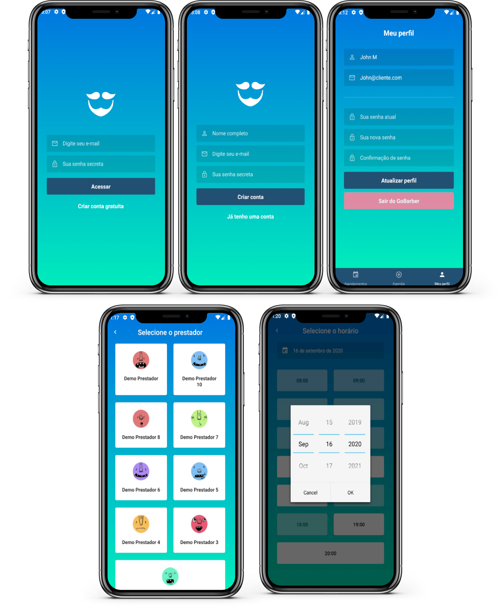

<h1 align="center">GoBarber mobile</h1>

<p align="center">
  

  <a href="https://www.linkedin.com/in/helitonoliveira/">
    
  </a>

  

  <a href="https://github.com/heliton1988/gobarber/stargazers">
    
  </a>
</p>

<p align="center">
  <a href="#rocket-sobre">Sobre</a>&nbsp;&nbsp;&nbsp;|&nbsp;&nbsp;&nbsp;
  <a href="#wrench-ferramentas-utilizadas">Ferramentas utilizadas</a>&nbsp;&nbsp;&nbsp;|&nbsp;&nbsp;&nbsp;
  <a href="#dizzy-funcionalidades">Funcionalidades</a>&nbsp;&nbsp;&nbsp;|&nbsp;&nbsp;&nbsp;
  <a href="#arrowdown-como-clonar-o-projeto">Baixe o projeto</a>&nbsp;&nbsp;&nbsp;
</p>

<h2>
  
</h2>

## :memo: Sobre

Esta é a versão mobile da aplicação GoBarber desevolvida em paralelo as aulas do Bootcamp GoStack da Rocketseat!

## :wrench: Ferramentas utilizadas

- [React Native](https://reactnative.dev/)
- [React Nativagion](https://reactnavigation.org/docs/hello-react-navigation/)
- [Redux](https://redux.js.org/)
- [Redux-Saga](https://redux-saga.js.org/)
- [Styled Components](https://styled-components.com/)
- [Alert](https://reactnative.dev/docs/alert#docsNav)
- [Polished](https://polished.js.org/)
- [React-Icons](https://react-icons.github.io/react-icons/)
- [Linear-Gradient](https://github.com/react-native-community/react-native-linear-gradient)
- [Vector Icons](https://oblador.github.io/react-native-vector-icons/)
- [Immer](https://immerjs.github.io/immer/docs/introduction)
- [Axios](https://github.com/axios/axios)
- [Date-fns](https://date-fns.org/)
- [Reactotron](https://github.com/infinitered/reactotron)
- [EditorConfig](https://editorconfig.org/)
- [ESlint](https://eslint.org/)

## :dizzy: Funcionalidades

**obs**: Esta aplicação mobile é destinada ao usuário final(cliente).
- Criar conta na aplicação;
- Efetuar login na aplicação;
- Alterar dados do perfil como nome, email e senha;
- Selecionar um prestador`(provider)` de serviços;
- Escolher uma data específica para marcar agendamento;
- Denifir o horário baseado em um range;

## :arrow_down: Como clonar o projeto

**Observações**: é necessário ter executado os passos inicias listados na pagina inicial do projeto [página inicial](https://github.com/heliton1988/gobarber).<br />

Também é preciso ter baixado e configurando um emulador como o [Android Studio](https://developer.android.com/studio).<br />
caso tenha dificuldade em configurar seu ambiente de desenvolvimento com o emulador, siga o passo a passo descrito neste tutorial: [Clique Aqui!](https://react-native.rocketseat.dev/android/emulador) <br />

Agora sim, está tudo pronto para rodar o projeto e se bricar com ele, Porém é necessário ter o servidor da aplicação rodando para que tudo funcione perfeitamente, caso ainda não tenha feito, siga os passos listados neste link: [Clique em mim!](https://github.com/heliton1988/gobarber/tree/master/backend).<br />

`antes de rodar o projeto, abra o emulador` <br />
**rode o projeto**<br />

```bash
# estando na pasta mobile, rode o comando
$ yarn start

# rode o projeto no emulador
$ yarn android
```
