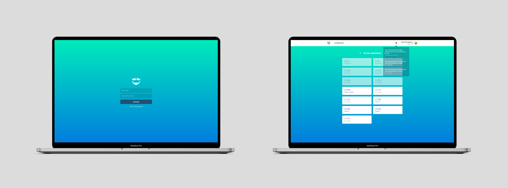

<h1 align="center">GoBarber Web</h1>

<p align="center">
  <a href="#rocket-sobre">Sobre</a>&nbsp;&nbsp;&nbsp;|&nbsp;&nbsp;&nbsp;
   <a href="#wrench-ferramentas-utilizadas">Ferramentas utilizadas</a>&nbsp;&nbsp;&nbsp;|&nbsp;&nbsp;&nbsp;
  <a href="#dizzy-funcionalidades">Funcionalidades</a>&nbsp;&nbsp;&nbsp;|&nbsp;&nbsp;&nbsp;
  <a href="#arrowdown-como-clonar-o-projeto">Baixe o projeto</a>&nbsp;&nbsp;&nbsp;
</p>

<p align="center">
  

  <a href="https://www.linkedin.com/in/helitonoliveira/">
    
  </a>

  

  <a href="https://github.com/heliton1988/gobarber/stargazers">
    
  </a>
</p>

<p>
  
</p>


## :rocket: Sobre

O GoBarber é uma aplicação que foi desenvolvida no decorrer do Bootcamp GoStack da Rocketseat, focada em agendamentos de serviços de beleza. <br />

É uma aplicação dedicada a o provedor de serviços, onde ele é obrigatóriamente gadastrado e tem acesso a todas as funcionalidades da aplicação, como listar e conferir seus agendamentos, visualizar quem são os outros providers... <br />

## :wrench: Ferramentas utilizadas

- [ReactJS](https://pt-br.reactjs.org/)
- [Redux](https://redux.js.org/)
- [Redux-Saga](https://redux-saga.js.org/)
- [Styled Components](https://styled-components.com/)
- [React-Toastify](https://github.com/fkhadra/react-toastify)
- [Polished](https://polished.js.org/)
- [React-Icons](https://react-icons.github.io/react-icons/)
- [Unform](https://github.com/Rocketseat/unform)
- [History](https://reactrouter.com/web/api/history)
- [Date-fns](https://date-fns.org/)
- [Yup](https://www.npmjs.com/package/yup)
- [Immer](https://immerjs.github.io/immer/docs/introduction)
- [Axios](https://github.com/axios/axios)
- [Reactotron](https://github.com/infinitered/reactotron)
- [EditorConfig](https://editorconfig.org/)
- [ESlint](https://eslint.org/)

## :dizzy: Funcionalidades

**obs**: Esta versão web da aplicação é destinada aos prestadores de serviços`(provider)`.

- Criar conta na aplicação
- Efetuar login na aplicação
- Alterar foto de perfil
- Editar dados como name, e-mail e senha
- Notificação de novo agendamento
- Listar todos os agendamentos de uma data específica
- Verificar quais clientes efetuaram agendamento

## :arrow_down: Como clonar o projeto

**Observações**: é necessário ter executado os passos inicias listados na pagina inicial do projeto [página inicial](https://github.com/heliton1988/gobarber).<br />

Agora sim, está tudo pronto para rodar o projeto e se bricar com ele, Porém é necessário ter o servidor da aplicação rodando para que tudo funcione perfeitamente, caso ainda não tenha feito, siga os passos listados neste link: [Clique em mim!](https://github.com/heliton1988/gobarber/tree/master/backend).<br />

**rode o projeto**<br />

```bash
# estando dentro da pasta web rode o comando
yarn start
```
